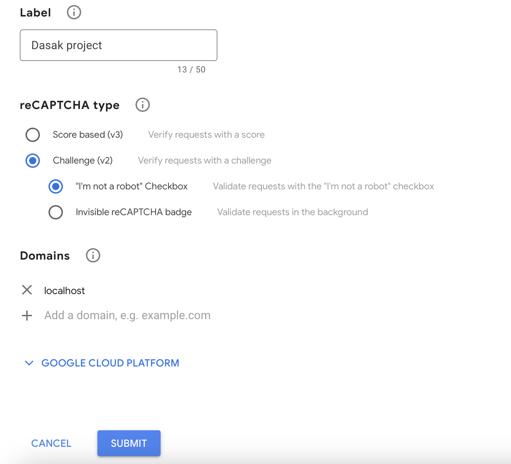
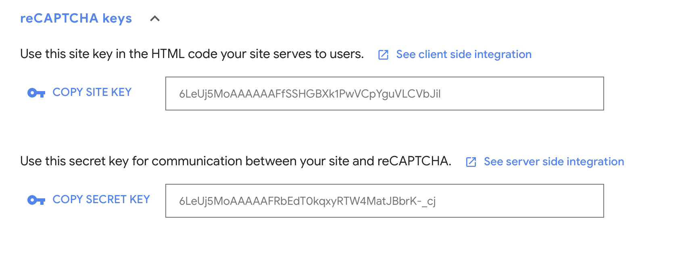
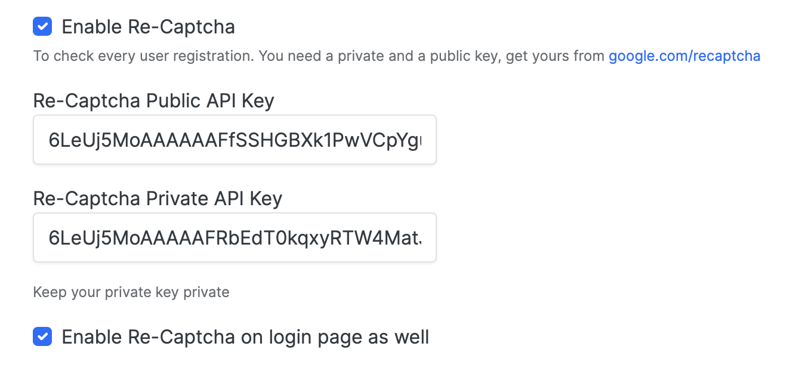

## Steps required to add reCAPTCHA to NodeBB


### Add and configure NodeBB plugin
1. **go to the Admin panel > Extended > Plugins**


2. **Search nodebb-plugin-spam-be-gone-fix and choose install**


3. **Activate the nodebb-plugin-spam-be-gone-fix plugin and rebuild the website**


### Create API keys for google reCaptcha
1. **go to the  [Google reCaptcha website](https://www.google.com/recaptcha/admin/site/ "Google's reCaptcha") and register a new site and add your domain and version.**


   


2. **Find your API keys in the settings page of your registered site.**


   


### Add keys to NodeBB website
1. **Go to the Admin Panel > plugins > Spam Be Gone Fix > Google reCAPTCHA**


2. **Add API keys and enable reCAPTCHA on logins**


   


### Final step
**Save changes and rebuild the website**
 ```bash
 ./nodebb stop
 ./nodebb build
 ./nodebb start
 ```
